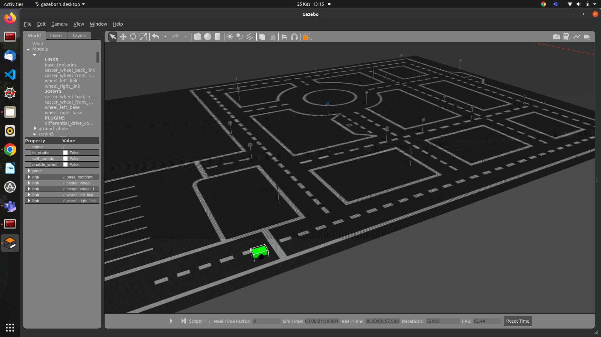
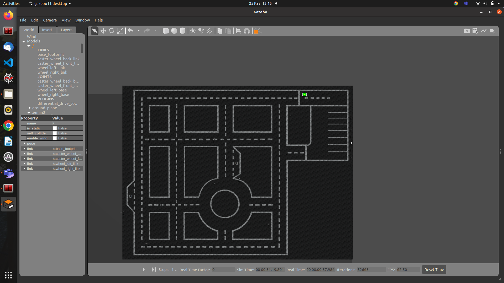
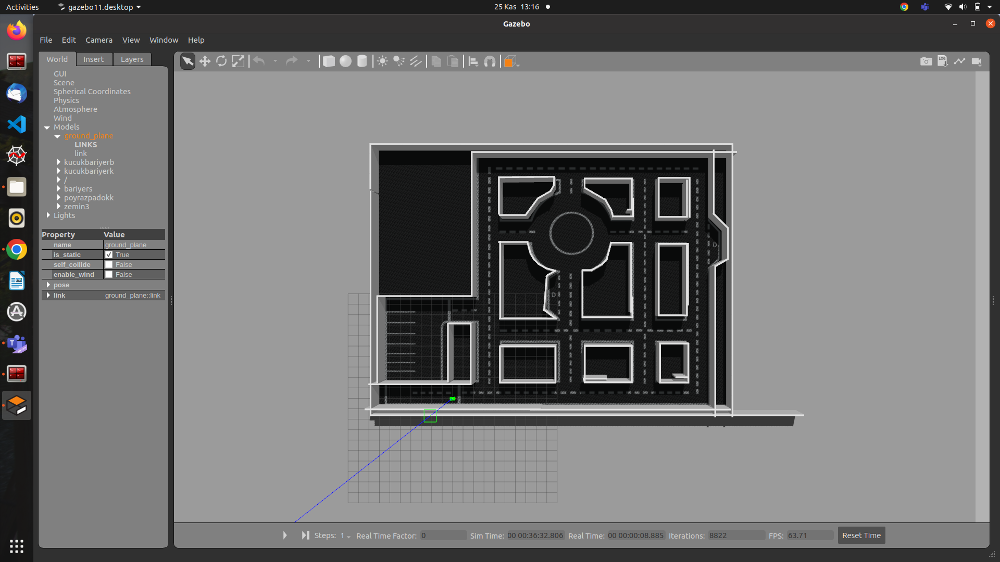
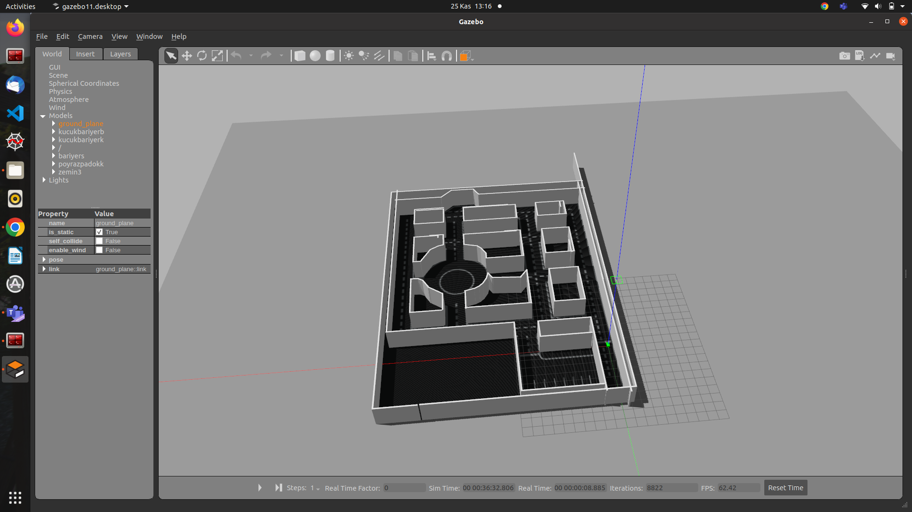

# robot_ve_ortam

dosyanın içindeki robotu ve ortamı kullanmak için dosyaları kendi catkin_ws/src klasörünün içine koymanız gerekir 
daha sonasında dosyaların içindeki pathleri(dosya yollarını) kendi bilgisayarınızdakine göre değiştirmeniz lazım

  
  
  
  
